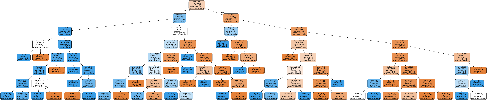

Machine Learning - Predicting Survival on the Titanic
================
Sylvia Lee(sylvia19) and Patrick Tung(ptung)
23 Nov, 2018

### Table of Contents

1.  Introduction
2.  Usage
3.  Dependencies
4.  Exploratory Visualizations
5.  Prediction
    -   Decision Tree Graphic
    -   Predictions
    -   Feature Importance Ranking
6.  Limitations

### Introduction

**Who will survive through the Titanic disaster?**

For most people, "Titanic" is both a classic movie and a beautiful love story. However, the infamous Titanic catastrophe had also been said to be a prime example of social stratification and status discriminations in the 1900s. In addition to the "women and children first" evacuation policy, it had been rumored that the lives of the people with social prestige and high class standing were prioritized in the momment of danger. In this analysis, we used supervised machine learning (ML) to answer the question **"What are the 3 strongest predictors of people who survived on the Titanic?"**

We retrieved the data from [Kaggle's Titanic:Machine Learning from Disaster](https://www.kaggle.com/c/titanic) and developed a decision-classification-tree machine learning model focusing on following features:

-   Passenger class
-   Sex
-   Age
-   Number of siblings/spouses onboard
-   Number of parents/children onboard
-   Fare price

In our project, we explored the dataset by generating graphs of the features' distribution in the population of passengers. Subsequently we developed the decision tree model using Python's scikit-learn package and applied the model to a test dataset to predict the survival of the passenger given the same list of features. Lastly, we summarized our analysis by calculating the accuracy of our ML model and ranking the list of features' predictive power.

### Usage

Multiple Python scripts were written in the analysis procedure. The following outlined the steps taken to run this project.

1.  Clone this repository.

2.  Run the following code in the terminal at the project's root repository.

<!-- -->

    python src/clean_data.py data/raw/train.csv data/raw/test.csv data/raw/gender_submission.csv data/cleaned/cleaned_train.csv data/cleaned/cleaned_test.csv    
    python src/data_exploratory.py data/cleaned/cleaned_train.csv results/figure/
    python src/data_analysis.py data/cleaned/cleaned_train.csv data/cleaned/cleaned_test.csv results/
    python src/summarize_data.py results/model/decision_tree_model.sav results/train_prediction.csv results/test_prediction.csv results/
    Rscript -e 'rmarkdown::render("docs/Titanic_Predictive_Data_Analysis.Rmd")'

### Dependencies

-   Python libraries:
    -   argparse v1.1
    -   pandas v0.23.4
    -   numpy v1.15.3
    -   sklearn v0.20.0
    -   matplotlib v3.0.1
    -   seaborn v0.9.0
    -   pickle v4.0
    -   graphviz v0.8.4
-   R packages:
    -   here v0.1
    -   imager v0.41.1

### Exploratory Analysis

The RMS Titanic only carried enough life boats for one third of the passengers, and our data was reflective of this. The data showed disproportionately larger proportion of passengers that did not survive. Thus, we compared the feature distributions within the desinated groups, the "survived "and the "did not survive". We plotted each feature according to the passenger's survival status. Which allowed us to gain a sense of the differential distribution of features depending on the passenger's survival.

In general we found that the data reflected the "women and children first" evacuation policy. There seemed to be larger proportion of women and children that survived than those the did not. Interestingly, we found that there were indeed larger proportion of survived passengers that had the features of "first class passenger" and "paid high fare price". On the other hand, family size (number of parent, children, siblings and spouse) did not appear to cause large difference

**Age**

> 

> Fig 1. Histograms of ages among the passengers that survived (left) and did not survive (right).
> 

The shape of the distributions were very similar. Both ranges from 0 to ~70 years old and had a single peak at approximately 20 to 30 years old. However, as expected from the "women and children first" evacuation policy, the "survived" distribution had higher frequencies in the age range of 0 to 10 than the "did not survive" group.

**Sex**

> 

> Fig 2. Bar plot of sex distribution among the passengers that survived versus those did not survive.
> 

This figure cohered with our expectation that there would be more females that survived the catastrophe. In fact the number of survived females more than doubled the number of females that did not survive. In contrast, the number of males that survived was five times less than the number of males that did not survive.

**Passenger Class**

> 

> Fig 3. Bar plot of passenger class distribution among the passengers that survived versus those did not survive.
> 

There seemed to be a pattern in the survival proportion of the passenger classes. In the first class, larger proportion of passenger survived. In the second class, there was approximately equal proportion of passenger between those that survived and those that did not. In the third class, the proportion of those that did not survive was three times larger than the proportion that survived.

**Fare Price**

> 

> Fig 4. Histograms of fare prices paid by the passengers that survived (left) and did not survive (right).
> 

**Number of Parents/Children Onboard**

> 

> Fig 5. Histograms of number of parent or children that was onboard with the passengers that did survive (left) and did not survive (right).
> 

**Number of Siblings/Spouses Onboard**

> 

> Fig 6. Histograms of number of siblings or spouse that was onboard with the passengers that did survive (left) and did not survive (right).
> 

### Predictions and Evaluations

**Decision Tree Graphic**

**Predictions**

Below, is a snippet of our predictions for both the training data set and the testing data set:

|  PassengerId|  Pclass|  Sex|       Age|  SibSp|  Parch|     Fare|  Survived|  Prediction|
|------------:|-------:|----:|---------:|------:|------:|--------:|---------:|-----------:|
|            1|       3|    1|  22.00000|      1|      0|   7.2500|         0|           0|
|            2|       1|    0|  38.00000|      1|      0|  71.2833|         1|           1|
|            3|       3|    0|  26.00000|      0|      0|   7.9250|         1|           0|
|            4|       1|    0|  35.00000|      1|      0|  53.1000|         1|           1|
|            5|       3|    1|  35.00000|      0|      0|   8.0500|         0|           0|
|            6|       3|    1|  29.69912|      0|      0|   8.4583|         0|           0|
|            7|       1|    1|  54.00000|      0|      0|  51.8625|         0|           0|
|            8|       3|    1|   2.00000|      3|      1|  21.0750|         0|           0|
|            9|       3|    0|  27.00000|      0|      2|  11.1333|         1|           1|
|           10|       2|    0|  14.00000|      1|      0|  30.0708|         1|           1|

|  PassengerId|  Pclass|  Sex|   Age|  SibSp|  Parch|     Fare|  Survived|  Prediction|
|------------:|-------:|----:|-----:|------:|------:|--------:|---------:|-----------:|
|          892|       3|    1|  34.5|      0|      0|   7.8292|         0|           0|
|          893|       3|    0|  47.0|      1|      0|   7.0000|         1|           0|
|          894|       2|    1|  62.0|      0|      0|   9.6875|         0|           0|
|          895|       3|    1|  27.0|      0|      0|   8.6625|         0|           0|
|          896|       3|    0|  22.0|      1|      1|  12.2875|         1|           1|
|          897|       3|    1|  14.0|      0|      0|   9.2250|         0|           0|
|          898|       3|    0|  30.0|      0|      0|   7.6292|         1|           1|
|          899|       2|    1|  26.0|      1|      1|  29.0000|         0|           0|
|          900|       3|    0|  18.0|      0|      0|   7.2292|         1|           1|
|          901|       3|    1|  21.0|      2|      0|  24.1500|         0|           0|

> Table 1 and 2. Snippet of Predictions for both the Training and Testing sets.

**Model Performance**

To evaluate the accuracy of the model, we used our testing data, which was not part of the training model. We then used this accuracy score to compare with the accuracy score we achieved from the training model. What we are trying to see here is whether or not there is an increase in the accuracy of our testing model to training model. We do not want our model to be overfit and therefore, cause poor generalization issues.

The accuracies we obtained are presented in the following table:

|    X| set   |  n\_total|  n\_correct\_pred|  n\_incorrect\_pred|  accuracy|
|----:|:------|---------:|-----------------:|-------------------:|---------:|
|    0| train |       342|               266|                  76|    0.7778|
|    1| test  |       152|               128|                  24|    0.8421|

> Table 3. Accuracy scores for training and testing sets.

As you can see, our model predicted the training data set with an accuracy of 0.7778, predicted the testing data set with an accuracy of 0.8421. It would seem that our model is quite generalized for our prediction and therefore, we obtained a much higher accuracy score on the testing than on the training data set.

**Feature Importance Ranking**

The ultimate goal of our research is to determine which variables in the data set are among the most important. To do this, we took our tree and generated an importance score. The importance score evaluated by sklearn is the "gini importance", also known as "mean decrease impurity". Essentially, the higher the value here, the more important the feature is. You can see how our features are ranked below.

|    X|  Rank| Feature |  Importance|
|----:|-----:|:--------|-----------:|
|    0|     1| Sex     |   0.4787907|
|    1|     2| Pclass  |   0.1702613|
|    2|     3| Age     |   0.1554545|
|    3|     4| Fare    |   0.1309192|
|    4|     5| SibSp   |   0.0496373|
|    5|     6| Parch   |   0.0149370|

> Table 4. Ranks of each feature based on Gini Importance

From our results, we can determine that the top three most important features in our model is: 1) Sex, 2) Passenger Class, 3) Fare Prices. The gini importances were 0.4788, 0.1703, and 0.1555 respectively.

### Limitations

First of all, the biggest limitation to our project is that we only chose one type of model, which is decision tree. I believe that we could have used tested out different models for making our predictions, however, because we have not really learned a lot of models, we were wary of fitting something that we were unfamiliar with. Therefore, to compensate for having choosing only one model, we decided to use cross validation to pick the best hyperparameter for our decision tree. We performed cross validation on our tree so that we could choose the best `max_depth`.

Another limitation that we encountered during this project was that we used means and medians for the imputation of missing values. We could have decided to use regressors to make predictions on the best value to be inserted into the missing values. However, this was somewhat beyond our current understanding, so we decided that using the means and medians were sufficient imputation methods for our predictions.

Lastly, for our prediction, we decided to subset the data set to only the relevant features that we were looking for in our research question. The entire data set that we originally started with had many more features such as where the passenger embarked, however, to simplify the question a little bit, we decided to use only a subset of the features to predict survival rates. Despite using less features, we believe that we still performed quite well with our predictions.
