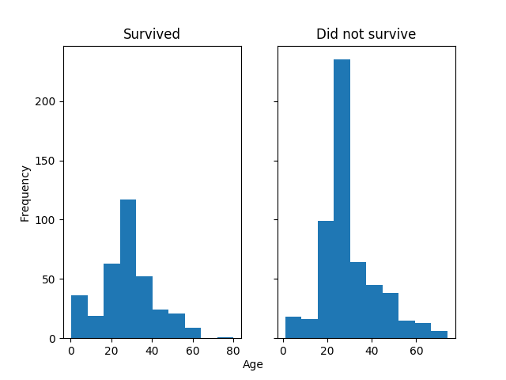
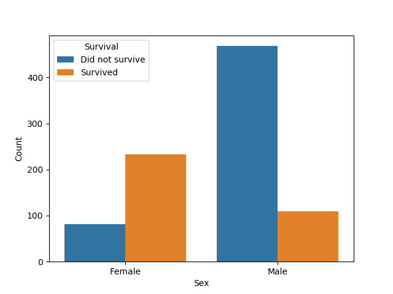
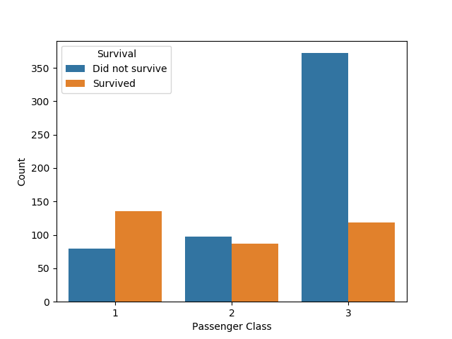
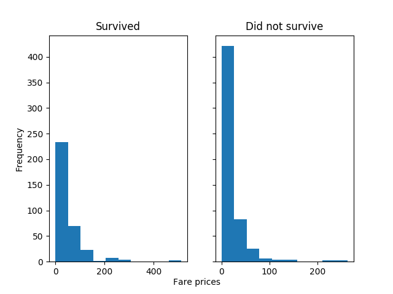
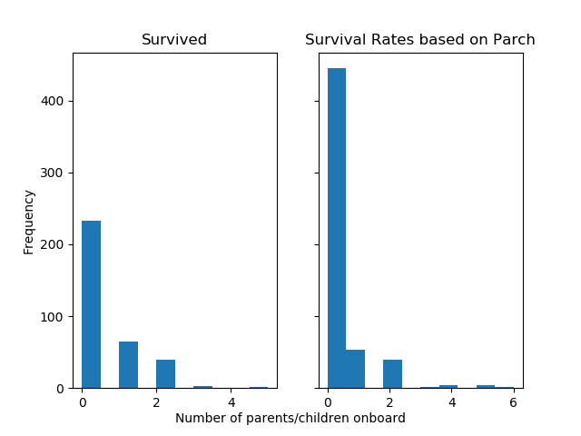
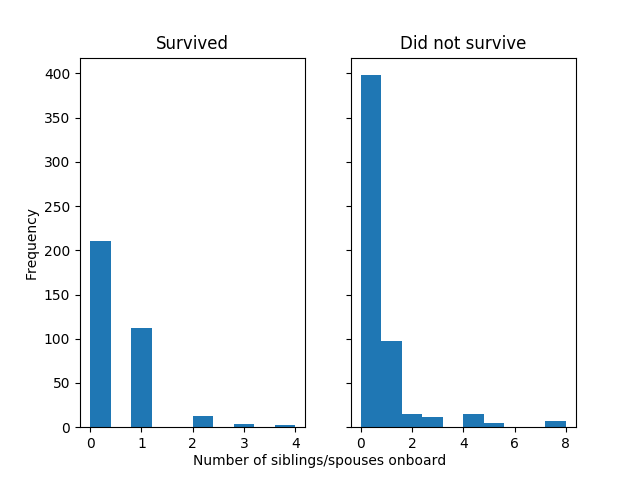

```{r setup, include=FALSE}
knitr::opts_chunk$set(echo = TRUE)
knitr::opts_knit$set(root.dir = here::here())
```

### Usage
1. Clone this repo and use the following command line code.
```
python src/clean_data.py data/raw/train.csv data/raw/test.csv data/raw/gender_submission.csv data/cleaned/cleaned_train.csv data/cleaned/cleaned_test.csv    
python src/data_exploratory.py data/cleaned/cleaned_train.csv results/images/
python src/data_analysis.py data/cleaned/cleaned_train.csv data/cleaned/cleaned_test.csv results/
```

### Dependencies
+ Python libraries:
  + argparse
  + pandas
  + numpy
  + sklearn
  + matplotlib
  + seaborn
  + pickle
  + graphviz

### Table of Contents
1) Introduction
2) Visualizations
3) Prediction
  + Predictions
  + Feature Importance Ranking
4) Limitations

### Introduction
*Who will survive through the Titanic crash?*

We will do an analysis on the data set from [Kaggle's Titanic:Machine Learning from Disaster](https://www.kaggle.com/c/titanic). It includes information about the passengers on the Titanic and if they survived the disaster or not. All data was downloaded from the site as csv files and uploaded into the [data/raw/](https://github.com/UBC-MDS/sylvia_patrick_Titanic_Survival_ML/tree/master/data/raw) directory. 

To prove that we can load the dataset, we have created a `data_import.py` Python script to read and import the `training.csv` dataset. The script can be found in the `src` directory.

**Research Question:** What are the 3 strongest predictors of people who survived on the Titanic?

This is a predictive research question, so we will be implementing a classification decision tree model. 

To effectively predict the survival of passengers onboard, we will analyze features including:
- Passenger classes
- Sex
- Age
- Number of siblings/spouses onboard
- Number of parents/children onboard
- Fare prices

### Visualizations

Survival Rates by Features:

Age Plot:


Sex Plot:


Passenger Class Plot:


Fare Plot:

Number of Parents/Children Onboard Plot:

Number of Siblings/Spouses Onboard Plot:



### Predictions and Evaluations

*Predictions*
Below, is a snippet of our predictions for both the training data set and the testing data set:
```{r echo=FALSE}
train_prediction <- read.csv("results/train_prediction.csv")
test_prediction <- read.csv("results/test_prediction.csv")
print(head(train_prediction, 10))
print(head(test_prediction, 10))
```

*Model Performance*
To evaluate the accuracy of the model, we used our testing data, which was not part of the training model. We then used this accuracy score to compare with the accuracy score we achieved from the training model. What we are trying to see here is whether or not there is an increase in the accuracy of our testing model to training model. We do not want our model to be overfit and therefore, cause poor generalization issues. 

The accuracies we obtained were as:
```{r echo=FALSE}
accuracies <- read.csv("results/accuracies.csv")
print(accuracies)
```
0.7778 for the training data set, and 0.8421 for the testing data set. It would seem that our model is quite generalized for our prediction and therefore, we obtained a much higher accuracy score on the testing than on the training data set. 

*Feature Importance Ranking*
The ultimate goal of our research is to determine which variables in the data set are among the most important. To do this, we took our tree and generated an importance score. The importance score evaluated by sklearn is the "gini importance", also known as "mean decrease impurity". Essentially, the higher the value here, the more important the feature is. You can see how our features are ranked below.
```{r echo=FALSE}
rank <- read.csv("results/feature_ranks.csv")
print(rank)
```
From our results, we can determine that the top three most important features in our model is: 1) Sex, 2) Passenger Class, 3) Fare Prices.